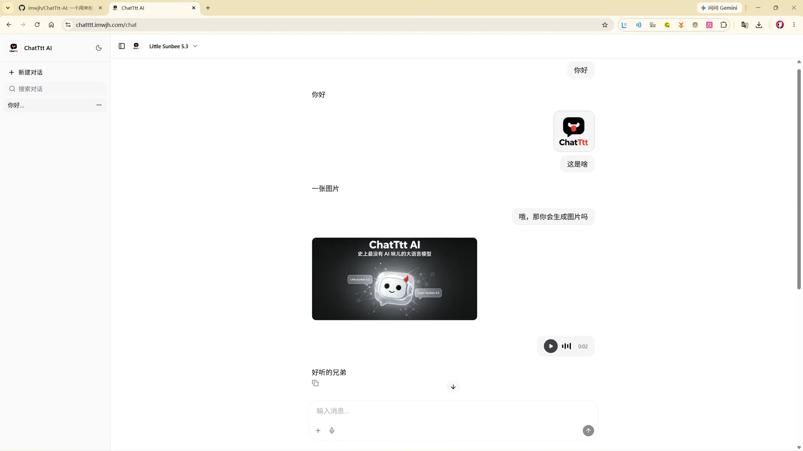
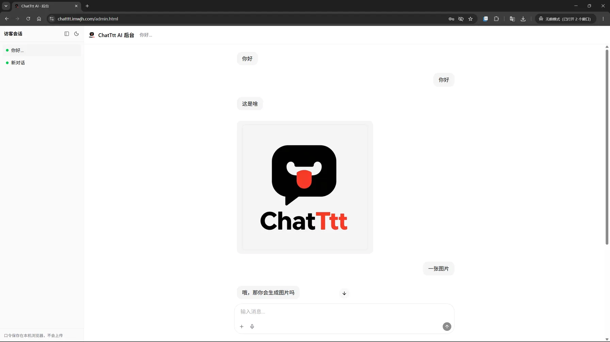

# ChatTtt AI 💬


一个用来**整蛊朋友的「假 AI」聊天网页**：界面做得跟正经 AI 助手一模一样——模型选择器、打字机动画、思考中转圈……朋友以为在和一个顶级大模型对话，实际上每一句都是**你本人在后台偷偷扮演的** 😈

> 纯玩乐/整活项目，追求「快速跑起来」，不依赖任何数据库和云服务。请适度使用，友情翻车概不负责。

## 😈 整蛊原理

```
朋友的视角：打开网页 → 选个模型（都是假的）→ 发消息 → "AI" 认真回复
你的视角：  打开后台   → 看到朋友发来的消息 → 你说什么"AI"就说什么
```

- 前台有「模型选择器」（Little Sunbee 5.3 / Super Sunbee 5.5 / Fuck-Image 2.1），全是演的
- 你回复后，前台会以打字机效果逐字输出，还带"正在思考"动画，仪式感拉满
- 支持发图片、语音输入，越真越好骗

## ✨ 功能特性

**前台（给朋友看的）**
- 💬 实时收发消息（Socket.io），回复带打字机动画 + "AI 正在思考"指示点
- 🤖 以假乱真的模型选择器与聊天界面
- 🖼️ 发送图片：前端自动压缩到几百 KB，图片只存双方浏览器 IndexedDB，服务器不落盘
- 🎤 语音消息：真实录音（MediaRecorder，最长 30s），音频同样只存双方浏览器 IndexedDB
- 🌗 深色 / 浅色主题
- 📝 会话本地持久化：新建、重命名、删除会话，刷新不丢
- 🔌 断线重连自动补收：掉线期间漏掉的后台回复会在重连后自动补进对话，不丢消息
- ⚠️ 后台无人在线时，前台显示与真实网络断连同款的错误提示（整蛊真实感 +1）

**后台（给你用的）**
- 👥 受害者列表：以其首条消息自动命名，绿点标记在线状态
- 🔔 未读提醒：侧边栏折叠时新消息触发红点闪烁
- 📂 侧边栏可折叠收起（状态持久化）
- 💬 与前台互通：文字 / 图片 / 语音三种消息双向互发，访客"正在输入"实时可见
- 💾 你的聊天记录保存在你浏览器 localStorage，不上传云端
- 🔑 口令登录（默认 `seegud123`，可用环境变量覆盖）

## 📸 界面预览

<table>
  <tr>
    <td align="center"><b>前台（朋友看到的）</b></td>
    <td align="center"><b>后台（你操作的）</b></td>
  </tr>
  <tr>
    <td></td>
    <td></td>
  </tr>
</table>

## 🛠️ 技术栈

| 端 | 技术 |
|---|---|
| 前端 | React 19 · Vite · TypeScript · Tailwind CSS 4 · [@assistant-ui/react](https://www.assistant-ui.com/) |
| 后端 | Node.js · Express 5 · Socket.io |
| 媒体存储 | 图片/语音存双方浏览器 IndexedDB（图片 canvas 压缩至 ~280KB WebP，语音 WebM/Opus） |
| 文字记录 | 各自浏览器 localStorage |

> ⚠️ 注意：服务器只在内存中转消息，**重启后未送达的离线消息会丢失**；各端的聊天记录都存在各自的浏览器里。这是刻意为之的设计——不建数据库，零云端依赖。

## 📁 项目结构

```
ChatTtt/
├── web/                # 前端（前台 + 后台双入口）
│   ├── index.html      # 前台入口（给朋友的）
│   ├── chat.html       # 聊天页入口（/chat）
│   ├── admin.html      # 后台入口（给你的）
│   ├── public/         # 静态资源（OG 图、robots.txt、sitemap.xml、llms.txt、隐私政策、服务条款）
│   └── src/
│       ├── App.tsx     # 前台主逻辑（Socket 接入、断线补收）
│       ├── admin.tsx   # 后台主逻辑（多受害者切换、未读红点）
│       ├── lib/image-store.ts        # IndexedDB 存储 + 图片压缩 + idb:// 引用解析
│       └── components/assistant-ui/  # 聊天 UI 组件（气泡、输入框、录音按钮等）
└── server/
    └── server.js       # Express + Socket.io 服务（内存中转）
```

## 🚀 本地快速启动

### 环境要求

- Node.js ≥ 20（建议 22+）

### 1. 安装依赖

```bash
# 终端 1 —— 后端
cd server
npm install

# 终端 2 —— 前端
cd web
npm install
```

### 2. 启动服务

```bash
# 终端 1 —— 启动后端（默认端口 3001）
cd server
npm start

# 终端 2 —— 启动前端开发服务器（默认端口 5173）
cd web
npm run dev
```

### 3. 打开页面

| 页面 | 地址 | 说明 |
|---|---|---|
| 落地页 | http://localhost:5173 | 产品介绍页，「立即体验」进入聊天 |
| 前台 | http://localhost:5173/chat | 发给朋友 |
| 后台 | http://localhost:5173/admin.html | 口令：`seegud123`，留给自己 |

两个页面各开一个浏览器窗口（或一个开无痕窗口），先自己和自己对一遍戏。

### 方式 B：生产模式（单端口）

```bash
cd web
npm run build        # 构建产物输出到 web/dist/

cd ../server
npm start            # 后端自动托管 dist，监听 3001
```

此时所有页面统一从 **http://localhost:3001** 访问（`/` 落地页、`/chat` 前台、`/admin.html` 后台），无需 Vite。

## 📶 局域网整蛊（同一 WiFi 下开整）

开发模式已开启 `host: true`，同一 WiFi 下朋友的手机可以直接访问你电脑上的服务：

1. 查看你电脑的局域网 IP
   - Windows：`ipconfig` 看「IPv4 地址」（如 `192.168.1.100`）
   - macOS / Linux：`ifconfig` 或 `ip addr`

2. 把这个链接发给朋友（或让他扫码连你的热点后访问）：

   ```
   http://192.168.1.100:5173/chat
   ```

3. 他一发消息，你的后台就会弹出新会话——**开始你的表演**：
   - 别回太快，AI 也有"思考时间"
   - 偶尔打错字再撤回重发更真实（功能没有，自己把握节奏）
   - 图片都支持，他说"你看这张图"你也能看到

4. 等他惊呼"这 AI 也太聪明了吧"，恭喜整蛊成功 🎉

> 💡 **防火墙提示**：如果朋友打不开，大概率是系统防火墙拦了端口。
> - Windows：设置 → 防火墙 → 允许应用通过防火墙 → 勾选 Node.js（专用网络）
> - 或者临时关闭防火墙测试

## 🚢 部署上线（Render 免费部署）

想让不在同一 WiFi 的朋友也能聊？可以把整个项目免费部署到 [Render](https://render.com)——一个常驻容器，完整支持 WebSocket，**代码零改动**。

### 1. 推送代码到 GitHub

把本项目推送到你自己的 GitHub 仓库（公开或私有均可，Render 两种都支持）：

```bash
git remote add origin https://github.com/<你的用户名>/<仓库名>.git
git push -u origin main
```

### 2. 创建 Render 服务

1. 打开 [dashboard.render.com](https://dashboard.render.com)，用 **GitHub 账号**登录
2. 右上角 **New +** → **Web Service** → 选择本仓库并连接
3. 按下表填写配置：

| 配置项 | 值 |
|---|---|
| Region | Singapore（离国内最近） |
| Branch | `main` |
| Runtime | Node |
| Build Command | `cd web && npm install && npm run build` |
| Start Command | `cd server && npm install && npm start` |
| Instance Type | **Free** |

### 3. ⭐ 设置管理口令（重要）

还是在创建页面，往下找到 **Advanced → Add Environment Variable**，添加一条：

```
Key:   ADMIN_TOKEN
Value: 你的口令（字母数字符号混搭，12 位以上，别用默认值）
```

这就是后台登录口令的真正来源——它加密保存在 Render 后台，**不存在于任何代码里**。以后想换口令：左侧 **Environment** 标签页修改 Value 并保存，服务会自动重新部署生效。

> ⚠️ 如果你创建时忘了填，随时可以进服务的 **Environment** 标签页补加，保存后自动重新部署。

### 4. 创建并等待

点 **Create Web Service**，构建日志滚动约 3~5 分钟后状态变为绿色 **Live**，你会得到一个形如 `https://xxx.onrender.com` 的网址。

验证：访问 `/chat` 应看到聊天页；`/admin.html` 用你设置的口令能进入后台。

### 5. 绑定自定义域名（可选）

1. 服务页 **Settings → Custom Domains → Add Custom Domain**，输入你的域名（如 `chat.example.com`）
2. Render 会给出一条 CNAME 记录值，去你的域名 DNS 解析面板添加：
   - 记录类型：`CNAME`
   - 主机记录：你的子域名前缀（如 `chat`）
   - 记录值：Render 提供的地址
3. 等 DNS 生效 + HTTPS 证书自动签发即可

### 6. 免费版注意事项

- 🌙 **15 分钟无访问自动休眠**，下次唤醒需 20~40 秒——朋友第一次打开慢属正常，先自己刷一遍热身
- 😴 容器重启后服务器内存清空，**未送达的离线消息会丢失**（各端已收到的本地记录不受影响）
- 💸 每月 750 小时免费实例时长 + 100 GB 流量，个人使用完全够

## ⚙️ 配置项（环境变量）

| 变量 | 默认值 | 说明 |
|---|---|---|
| `PORT` | `3001` | 后端监听端口 |
| `ADMIN_TOKEN` | `seegud123` | 后台登录口令 |

示例（自定义口令启动）：

```bash
# Linux / macOS
PORT=4000 ADMIN_TOKEN=my-secret node server.js

# Windows PowerShell
$env:PORT=4000; $env:ADMIN_TOKEN="my-secret"; node server.js
```

> 🔐 **安全提醒**：`seegud123` 只是本地开发的兜底默认值。**线上部署时务必通过平台环境变量设置自己的口令**（Render 见上文「部署上线」第 3 步），否则任何看过本仓库的人都能进你的后台。若口令意外泄露，直接更换环境变量并重新部署即可使其失效。

## 🧹 移除作者自带的百度统计（自部署必读）

本项目的 5 个页面（`index.html` / `chat.html` / `admin.html` / `public/privacy.html` / `public/terms.html`）中内置了作者的百度统计代码，用于作者自己统计访问量。如果你要自己部署，建议移除：

在每个 HTML 文件的 `<head>` 中找到以下代码块并整体删除：

```html
<!-- Baidu Analytics -->
<script>
  var _hmt = _hmt || [];
  (function () {
    var hm = document.createElement("script");
    hm.src = "https://hm.baidu.com/hm.js?6db19609f648c8ad155977594d8967fd";
    var s = document.getElementsByTagName("script")[0];
    s.parentNode.insertBefore(hm, s);
  })();
</script>
```

快速方法：在项目根目录全局搜索 `hm.baidu.com`，删除所有匹配的 `<script>` 块即可。若想换成自己的统计，把其中的站点 ID 替换为你在[百度统计平台](https://tongji.baidu.com/)创建应用后获得的 ID。

## 🖼️ 图片与语音存储方案

本项目对图片和语音做了「去服务器化」处理：

```
发送方选图/录音 → 图片 canvas 压缩（最长边 1600px，WebP ≤280KB）/ 语音 WebM
              → 存入本端浏览器 IndexedDB
              → socket 直传数据给对方（消息里只携带 idb://key 引用）
接收方收到   → 存入自己的 IndexedDB → 渲染时解析为 blob URL
服务器       → 仅内存中转，不写磁盘
```

好处：localStorage 不膨胀、服务器无存储压力、换设备图片自然消失（聊天记录随浏览器走，不留把柄 🙂）。
代价：清了浏览器数据图就没了——毕竟是玩乐项目。

## 🗺️ Roadmap

- [x] 部署上线（Render 免费部署，代码零改动，见上文「部署上线」）
- [ ] 预设"AI 人格"快捷回复脚本
- [ ] 消息撤回与已读回执

## 🙏 致谢

本项目的大部分能力站在开源社区的肩膀上：

- 聊天页面基于 [assistant-ui](https://github.com/assistant-ui/assistant-ui) 修改
- 落地页设计 GLM-5.3，修改完善 Ox-Alpha

## 👨‍💻 开发

项目开发由 ox-alpha、GLM5.3、[seegood](https://me.imwjh.com) 完成。

## 📄 License

MIT
